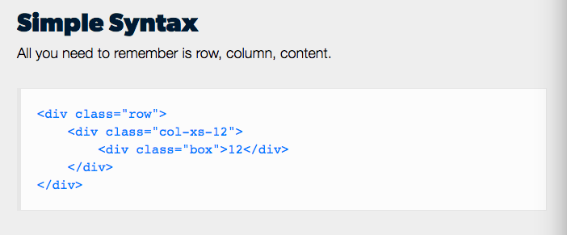
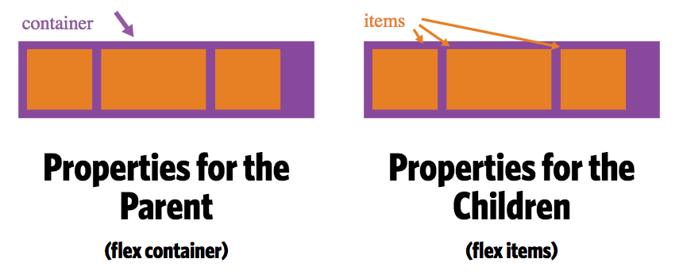
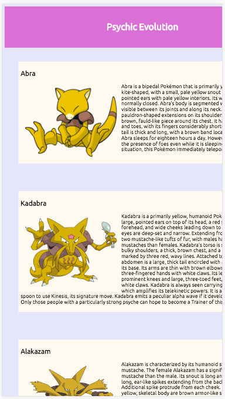
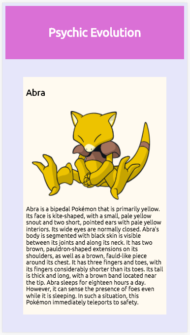

# Frontend: Use CSS to create responsive pages

## - [x] CSS includes media queries with mobile-first breakpoints 📲 (min-width instead of max-width)

* A mobile-first approach to styling means that styles are applied first to mobile devices. Advanced styles and other overrides for larger screens are then added into the stylesheet via media queries.

* Code for larger screens is usualy more complicated than the codes for smalller screens; therefore, coding mobile first can help simplify the code.

**min-width vs max-width**

* min-width queries are used to apply specific styling above a certain size

```[js]                                         if:
   body {
    background: Olive;
  }

  @ media (min-width: 400px) {
    body {
      background: FloralWhite;
    }
  }
  ```

*if the screen reaches 400px and above , the background color becomes FloralWhite.*

max-width queries are most valuable when you want styles to be implemented below a certain viewport size

```[js]                                         if:
   body {
    background: Olive;
  }

  @ media (max-width: 400px) {
    body {
      background: HoneyDew;
    }
  }
```

*if the screen goes below 400px, the background color becomes HoneyDew.*

 **A combination of both min-width and max-width media queries can help to constrain the styles between two different viewport sizes**

*Special thanks to [Zell](https://zellwk.com/blog/how-to-write-mobile-first-css/)*

## - [x] Uses flexbox / percentage-based widths to show content flowing to a grid

"Since flexbox is a whole module and not a single property, it involves a lot of things including its whole set of properties. Some of them are meant to be set on the container (parent element, known as "flex container") whereas the others are meant to be set on the children (said "flex items")."



*[CSS Tricks](https://css-tricks.com/snippets/css/a-guide-to-flexbox/)*



*[Flexbox Grid](http://flexboxgrid.com/)*

## - [x] Includes meta tags to set the viewport correctly

The viewport is a virtual window that display pages rendered by the web browser. Since the difference in screen size between mobile and desktop browser is extreme, web developers need to control the viewport's size and scale.

The meta viewport is meant to resize the layout view and control the page's dimensions and scaling.

If your layout needs at least 500 pixels of width:

```
<meta name="viewport" content="width=500, initial-scale=1">
```

###without meta tag





###with meta tag




*iPhone 6 viewport*
