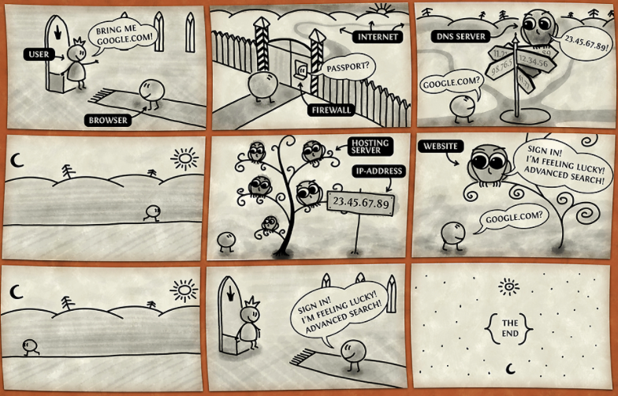

# Frontend Mastery: Discuss Key Frontend Concepts

## AJAX
  ### Definition:
  Asynchronous JavaScript And XML
  ### Description:
  * communicates with the server, exchange data, and update the page without having to refresh the page.
  * can send and receive information in various formats (JSON, HTML, XML)
  * most commonly used to request information from an API
  * since it's async, the rest of the code can run and the page + server doesn't freeze

## DOM
  ### Definition:
  Document Object Model
  ### Description:
  * an API that represents and interacts with any HTML or XML document
  * allows code running in a browser to access and interact with every node in the document
  * 'tree' data structure, each element is a node in the tree

## CSS
  ### Definition:
   Cascading Style Sheets
  ### Description:
  * a stylesheet language used to describe the presentation of a document written in HTML or XML
  * CSS describes how elements should be rendered on screen, on paper, in speech, or on other media.
  * *the 'skin'* 💄

## HTML
  ### Definition:
  HyperText Markup Language
  ### Description:
  * describes and defines the content of a webpage.
  * *the 'skeleton'* ☠️

## How do events work
  ### Description:
  * interface represents any event which takes place in the DOM
  * contains the properties and methods which are common to all events.
  * Consists of handlers and listeners:
    *   *handler is a function that runs when listener is triggered*

##  jQuery
  ### Description:
   A JavaScript Library that focuses on simplifying DOM manipulation, AJAX calls, and Event handling
  * a collection of code to make your life easier
  * helpful for DOM manipulation and AJAX
    * [jQuery CDN](https://code.jquery.com/)
    * *the 'brain' [JavaScript]* 💡

## Describe event delegation / bubbling
  ### Description:
  If we have a lot of elements handled in a similar way, then instead of assigning a handler to each of them – we put a single handler on their common ancestor

  * Bubbling events will then trigger any additional event listeners found by following the EventTarget's parent chain upward, checking for any event listeners registered on each successive EventTarget.
      * Event bubbling provides the foundation for event delegation in browsers
      * 'Bubbles UP' 🛁


  * Event delegation binds an event handler to a single parent element, and that handler will get executed whenever the event occurs on any of its child nodes
    * 'Delegate DOWN' 🗣

```
  event.target
```

## Describe how linking to stylesheets / images / scripts works as far as requests and responses
  ### Description:
  * first request sent to the server is for the HTML, if the HTML is there then it is returned to the client
  * Browser reads HTML top to bottom and any additional resource (img/scripts/CSS) needs to be requested / response sent

## Describe how urls are resolved in a browser
  ### Description:
  **http://** [ hypertext transfer protocol ]

  http:// **rabbits.fluffy-animals.com** [ domain: text to make the IP address readable to humans | 'rabbits' is the subdomain ]

  http:// rabbits.fluffy-animals.com **/myProfile** [ path ]

  http:// rabbits.fluffy-animals.com /myProfile **?name=Kilgore** [additional information | '?' indicate a query string ]

  
