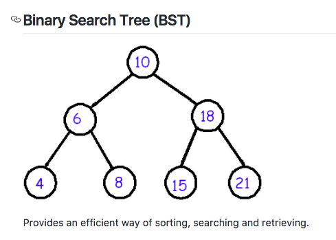
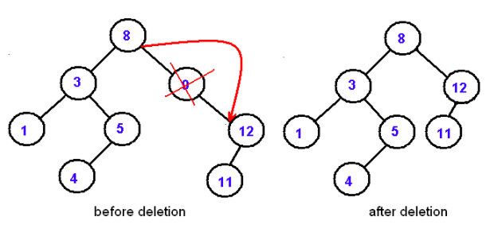
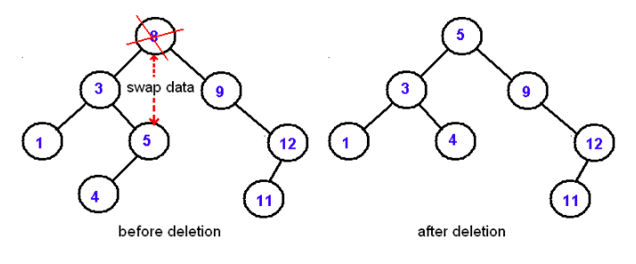

## Programming: Trees and Graphs

### Trees 🌳
A data structure that has collection of nodes
- no two references point to the same node
- each node has at most one parent
  - except for the root

#### Terminology:
>**Root:** the top node / where the collection starts
- no other nodes point to it

>**Child:** a node directly connected to another node when moving away from the root
- a child can only have one parent
  - no reference can be duplicated
- each child node is the root of a subtree

>**Parent:** a node directly connected to another node when moving toward the root

>**Siblings:** a group of nodes with the same parent

>**Descendant:** a node reachable by repeated proceeding from parent to child

>**Ancestor:** a node reachable by repeated proceeding from child to parent

>**Internal Node:** a node with at least one child

>**External Node || Leaf:** a node with no children

>**Degree:** number of subtrees of a node

>**Edge:** the connection between one node and another

>**Path:** a sequence of nodes and edges connecting a node with a descendant

>**Level:** the level of a node is defined by 1 + (the number of connections between the node and the root)

>**Height:**
 *of node-* the number of edges on the longest path from the root to the leaf
 *of tree-* the height of its root node

>**Depth:** the number of edges from the root node to the target node

### Advantages:
1. Reflect structural relationships in the data
2. Are used to represent heirarchies
3. Provide efficient insertion and searching
4. Very flexible
  - able to move subtrees around with minimum effort

### Binary Tree
A Binary Tree is a tree where each node has at least two children

#### Binary Search Tree:
- each node contains one key
  - also known as data
- the keys in the left subtree are less than the key in the parent node
  - ***L < P***
- the keys in the right subtree are greater than the key in the parent node
  - ***P < L***
- Duplicate keys are not allowed

**BST Search:**
- searching in a BST always starts at the root
- compare the data in the root to the key we are searching for
- if the node does not contain the key we proceed to the left or the right depending upon comparison
  - if the result of the comparison is negative, go left, otherwise, go right

> the recursive structure of a BST yields a recursive algorithm

**BST Search Complexity:**
A BST with *n* nodes has a minimum of *O(log n)* levels
- takes at least ***O(log n)*** comparisons to find a particular node

> a BST can degenerate to a linked list, reducing the search time to *O(n)*

**BST insertion:**
Start at the root and recursively go down the tree searching for the location to insert a new node
- no duplicate insertions

***Insertion Complexity: O(log n)***

**BST delete:**
- if the node being deleted is a leaf, then just delete it
- if the node being deleted has one child:
  - bypass the node being deleted

- if the node to be deleted has two childen:
  - split the tree into two subtrees
  - replace the node being deleted with the largest node in the left subtree
  - delete the largest node
    - by symmetry, the node being deleted can be swapped with the smallest node in the right tree

  

***Delete Complexity: O(log n)***

## Graphs 🍇
A graph data structure consists of a finite (and possibly mutable) set of verticies, nodes, or points
- used to define nodes with connecting edges

**Undirected Graph:** unordered pairs of vertices
- pairs are known as *edges, arcs or lines*

**Directed Graph:** a set of ordered pairs of vertices
- pairs are known as *arrows, directed edges, directed arcs, or directed lines*

### Uses
- Accessible Data Storage // Binary Tree
- Trees
- Path Finding
- Search Engine Ranking
- Flow Control

*and many more*

### Big O Complexity
*V = vertices , E = edges*

**Add Vertex:** O(1)  
**Add Edge:** O(1)  
**Remove Vertices:** O(E)  
**Delete Edge:** O(E)  
