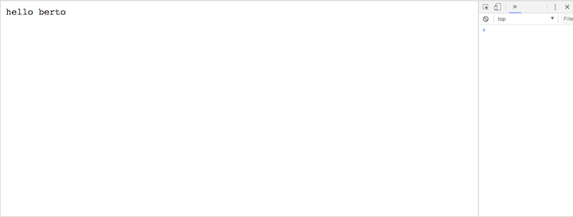
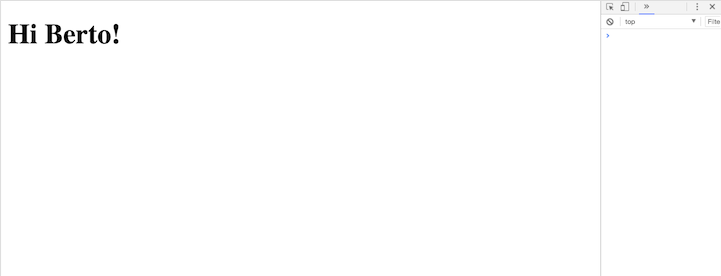

# Server-Side: Render HTML from a Server-side app

### Use express.static to serve client-side resources from the server


### Use any templating language to separate views into smaller sections

*Initiate npm and install express*
```
> npm init -y
```

```
> npm install express
```

*Add an app.js file*
```
> touch app.js
```

*in the app.js*
```js
//require 'express' and invoke it
const app = require('express')()

//create a get route
app.get('/', (request, response)=> {
  response.send('hello berto')
})

//listen on port 3000
app.listen(3000)
```

run
```
> node app.js
```
and go to localhost:3000


*add a public directory*
```
mkdir public
```
*Add an index.html file into public*
```
> touch index.js
```

now we want to serve the html statically so we will change the ```app.js```:
```js
const express = require('express')
const app = express()

app.use('/', express.static('./public'))
//when its at '/', it serves the public directory
app.listen(3000)
```


- you can add mutlpile ```html``` files to public and then depending on the route route, have them render when the url is changed in the browsers


lets try to make both public and render work:
```
$ npm install express-handlebars
```

 Directory Structure:
```
.
├── app.js
└── views
    ├── home.handlebars
    └── layouts
        └── main.handlebars

2 directories, 3 files
```

```js
const express = require('express')
const app = express()
var exphbs  = require('express-handlebars');

app.engine('handlebars', exphbs({defaultLayout: 'main'}));
app.set('view engine', 'handlebars');

app.use('/', express.static('./public'))
//when its at '/', it serves the public dir

//more dynamic
app.get('/render', (request,response)=>{
  response.render('home')
})

app.listen(3000)
```

*main.handlebars*
```html
<!DOCTYPE html>
<html>
<head>
    <meta charset="utf-8">
    <title>Example App</title>
</head>
<body>

    {{{body}}}

</body>
</html>
```
[[ ```exphbs``` will look here for the default layout, then handlebars will dicate where to plug in from ```home.handlebars``` ]]

* start the server:
```
> nodemon
```

* go to localhost:3000 **/render**

[[add screenshot]]

